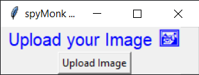

<div align="center">

# spyMonk Art Generator


</div>
<p align='center'> <b>You are welcome to contribute to this project if you are new to open-source and are looking for your first contribution </b> </p>

***

## Contributing Guidelines 📝

For contributing in this repository follow the guidelines mentioned in the [CONTRIBUTING](https://github.com/shubhajeet1207/spymonk_asciify/blob/master/CONTRIBUTING.md) file, where I've provided you steps to make your contributions.

Once the pull request is merged, you will find your awesome contribution card on our website.

Upon merging your PR, you can find your names on this [website](https://hacktoberfest22.netlify.app)

<div align="center">


</div>


This is an image transformation tool which can converts your image into ASCII, BLOCKS, PENCIL SKETCH Arts.

## Installations 🚀
For installing this tool follow the below commands:
```python
virtualenv virtual-env-name
```
By running this command a virtual environment will be created. To activate that:
```python
./virtual-env-name/Scripts/activate
```
After doing this, you just simply need to install the requirements from the requirements.txt file. For installing the packages all at once, you can run this command:
```python
pip install -r requirements.txt
```
This will install every mentioned packages in your created virtual environment.

## Usage 👨🏻‍💻
For running the program, simply run the below command:
```python
python start.py
```
This will run the python script of GUI. 
> **NOTE:** Don't change the directory of any files otherwise you have to change the import calling method. 
<br>

## ScreenShots 🖼
[ASCII Art](https://github.com/shubhajeet1207/spymonk_asciify/blob/master/examples/output%20images/ascify_testing_1.0.0.png)
<br>
[BLOCK Art](https://github.com/shubhajeet1207/spymonk_asciify/blob/master/examples/output%20images/blockify_testing_1.0.0.png)
<br>
[SKETCH Art](https://github.com/shubhajeet1207/spymonk_asciify/blob/master/examples/output%20images/sketchify_testing_1.0.0.png)

## Technologies Used 🛠


## Maintainer
---
<table>
  <tr>
    <td align="center">
      
      <br/>
      Shubhajeet Pradhan
      <br/>
      <a href="https://www.linkedin.com/in/shubhajeet-pradhan-b7747a156/">LinkedIn</a>
      <a href="https://github.com/shubhajeet1207">Github</a>
    </td> 
  </tr>
</table>

## License 
[MIT License](https://github.com/git/git-scm.com/blob/main/MIT-LICENSE.txt)

## Contributors
<a href="https://github.com/shubhajeet1207/spymonk_asciify/graphs/contributors">
  
</a>

---
<div align='center'>Please give it a star if you enjoyed contributing to this repository ⭐</div>